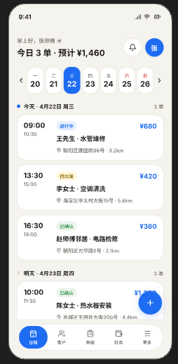
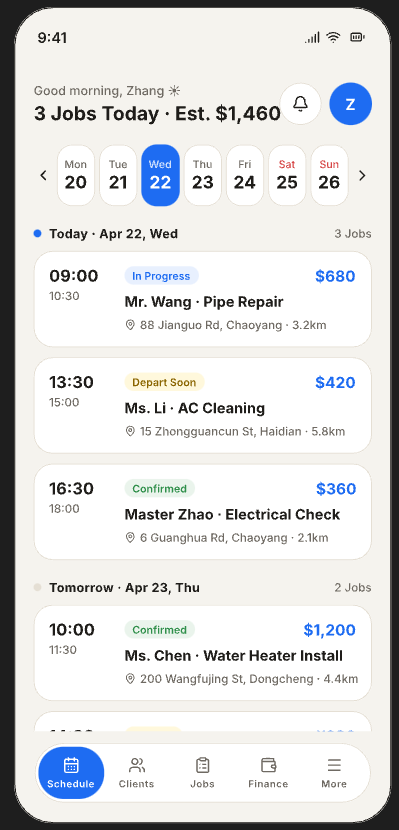
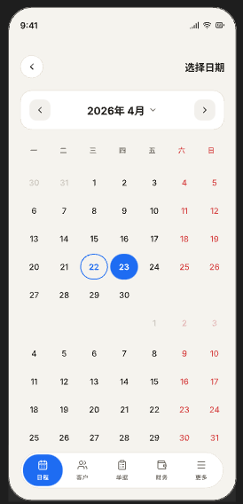
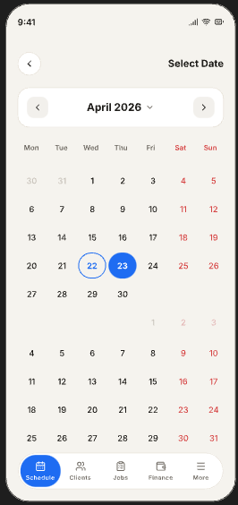
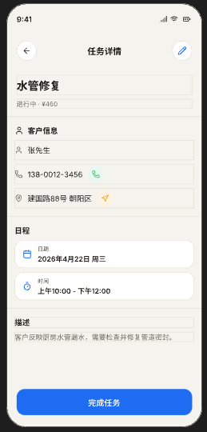
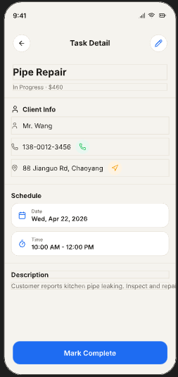
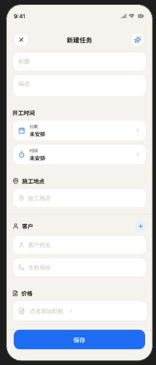
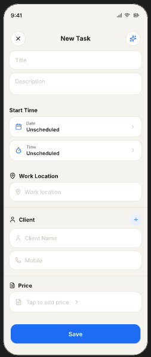
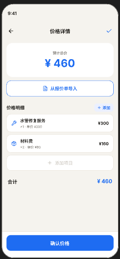
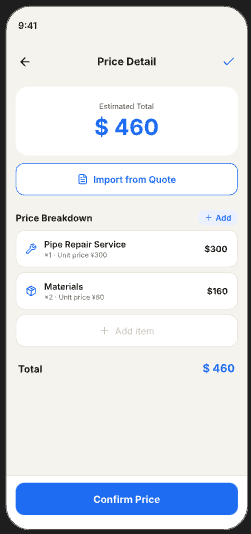

BlueMate App — Product Specification (spec.md)

我在澳洲布里斯班，我想做一个专门给蓝领tradie用的手机APP，APP的名字叫做Bluemate。

1. Overview
BlueMate 是一款为澳大利亚本地 tradies（电工、水管工、空调、园艺、handyman 等）打造的 轻量级日常办公管理 App。
目标是让 tradies在最短时间内完成：

当前MVP版本包括

任务管理（包括日程安排）

客户管理

票据管理（quote，invoice，template，草稿，历史票据）

收入统计

2. BlueMate 的核心价值：

极简、极快、无学习成本,支持中文

比 ServiceM8， trandify， jobber 更轻、更简单、更便宜

适合 1–2 人的小团队（每个人的用户界面是一样的，适合夫妻或者搭档使用）

移动端优先（Mobile-first）

3 Product Goals

让 tradies 在 30 秒内创建报价，可以使用模板快速创建

让 tradies 在 1 分钟内创建任务并排班

让发票流程支持半自动化（从报价 → 任务 → 发票）

提供一个 简单但可靠的收入统计系统（方便查看收入情况，和以后报税使用）

4 与同类产品的竞争力体现

除了英语外，提供中文服务（以后也可以包括越南语），产品上线以后，刚开始就主打中文市场

完全从蓝领实际情况出发，不用学习就会用，不需要复杂功能

价格便宜，计划29澳元每月，包含所有功能

免费试用3个月

3. Target Users

Brisbane 及澳洲本地的 tradies

1–2 人的小团队

不喜欢复杂软件

不愿意花时间学习系统

需要快速报价、快速排程、快速发票

4 设计原则

极简

大按钮

大字体

适合 tradies 在户外使用

强对比度

轻量动画

5. 页面设计

5.1 日程（schedule）

日程是 BlueMate 的核心goon功能之一，也是日常使用最多的界面。

在日程主页面，点击“周一”和“周日”两侧的“小箭头”，会进入“日期选择”界面，通过这个“日期选择”界面，可以在不同日期范围之间切换。

在日程主页面，点击一个任务，会进入“任务详情”界面

在日程主页面，点击右下的“+”号按钮可以，创建新的任务。
在这个创建新的任务界面，可以创建新的工作任务

“客户”一行右端的“+”，可以用来从客户目录中插入现有客户

点击“点击添加价格”按钮，会进入“价格详情”界面

5.2 客户（customer）

5.4 Quotes（报价）
报价流程必须极快。

字段：

Customer

Line items（description + qty + price）

Tax

Total

Valid until

Notes

功能：

Convert to job

Send via email

PDF export（后台自动生成）

5.5 Invoices（发票）
发票自动从 job 生成。

字段：

Invoice number

Customer

Items

Tax

Total

Paid / Unpaid

功能：

Mark as paid

Send invoice

Export PDF

5.6 Customers（客户管理）
轻量 CRM。

字段：

Name

Phone

Email

Address

Job history

Quote history

Invoice history

5.7 Income（收入统计）
简单但实用。

图表：

Weekly income

Monthly income

Outstanding invoices

6. 开发技术实现

目前，使用PWA技术，可以一套网页程序，在Android， IOS和电脑网页上面运行。

前端使用技术，Nextjs, react, typescript, tailwind（如果有需要可以补充）

后端技术使用restful API +  Spring Boot 3.3.x + Java 21 LTS， 会打包成docker image

代码存在github

使用github action做CI/CD pipeline

前端和后端程序部署在AWS EC2上面

图片存储在AWS S3， 前后端程序以及数据库都部署在一个EC2上面

5.1 Dashboard（主页面）
主页面不是 marketplace，也不是日历，而是 tradie 每天打开就能看到的 工作概览。

内容结构：

Today’s Jobs（今日任务）

Job title

Time

Status（Scheduled / In Progress / Completed）

Quick Actions（快捷操作）

Create Quote

Create Job

Create Invoice

Recent Activity（最近动态）

Quote sent

Invoice paid

Job completed

Income Summary（收入概览）

This week

